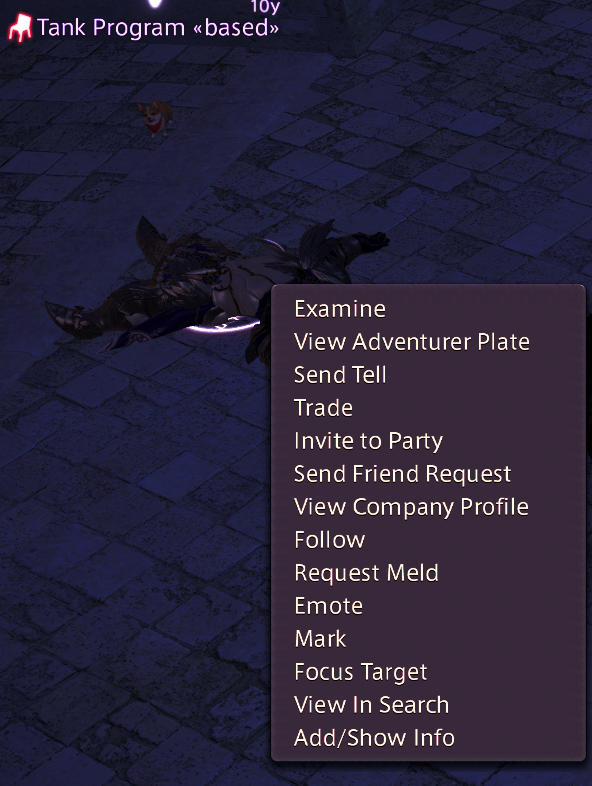

# RightClickSearchInfo

I don't see sharp.

Dead simple plugin I just want to have this feature in my vidya gayme.

**Note:** I don't think Dalamud has the capability to programatically call in-game chat commands or active in-game UIs. ATM, plugin only generates the boring long search command and copies it to clipboard.

## Usage

1. Through target context menu `View in Search`

2. Through chat command w/ mouse over: `/seamo`
