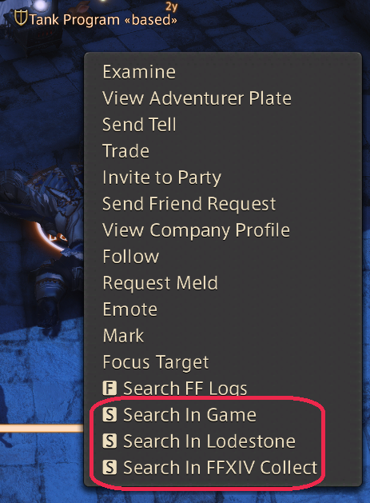

# RightClickSearchInfo

I don't see sharp.

Dead simple plugin I just want to have this feature in my vidya gayme.

## Usage

This plugin will add two context menu items and two commands to open a player target in search or lodestone.

1. Through target context menu `View In Search` / `Open In Lodestone`

2. Through chat commands w/ mouse over: `/seamo` and `/lodmo`

> **Note:** This plugin uses input automation to interact with FFXIV's chat
